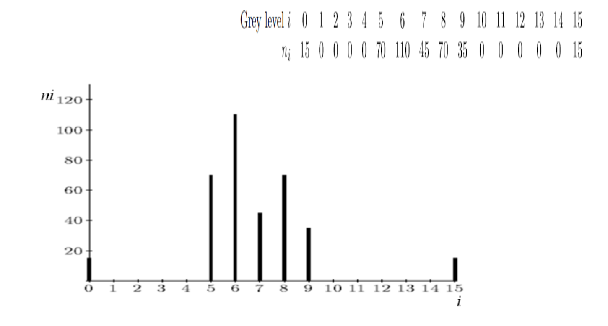
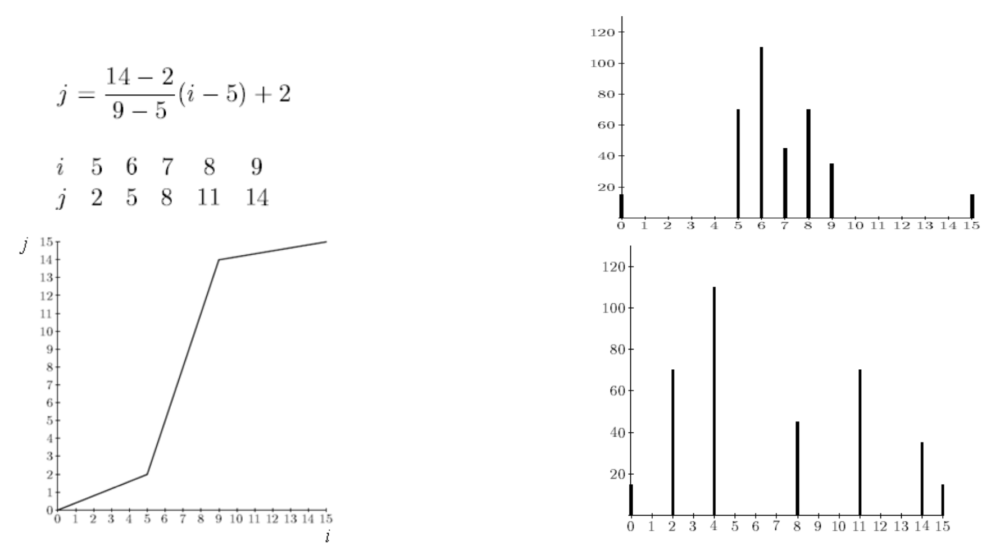
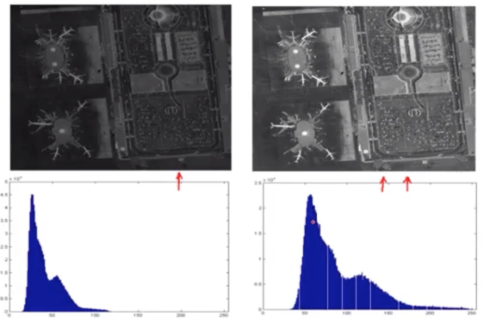
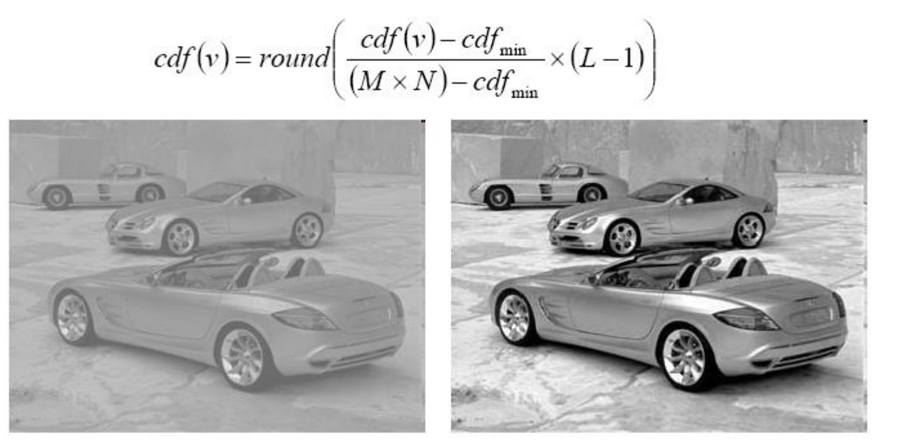
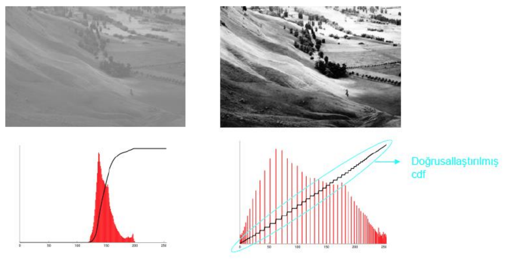
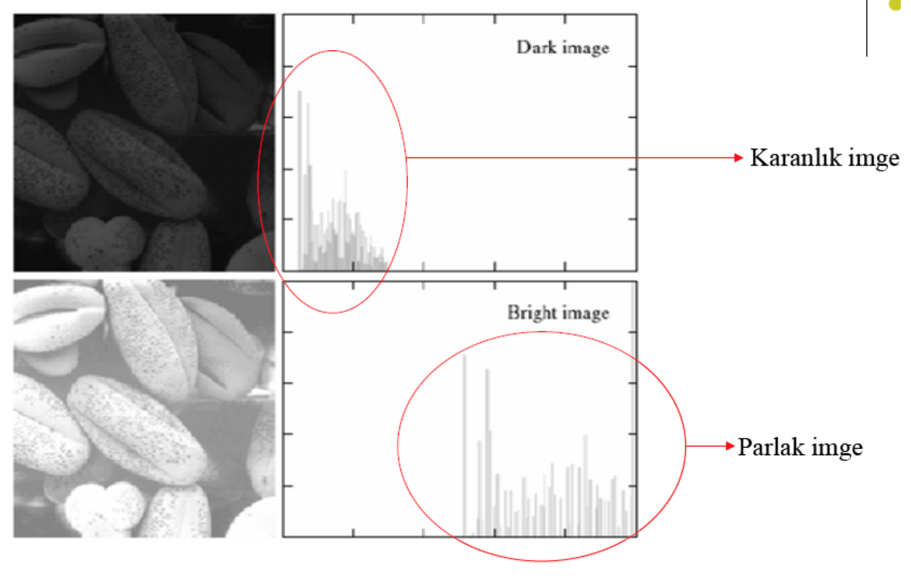
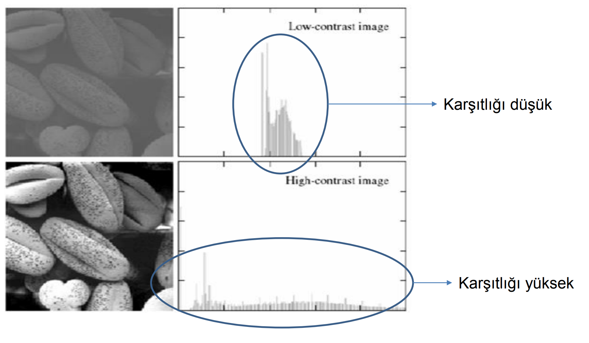

## Proje Konusu:

Histogram Processing

## Tanım

+ Amaç resimlerin daha net görülmesini sağlamaktır.

+ Histogram, sayısal bir resim içerisinde her renk değerinden kaç adet olduğunu gösteren grafiktir. Bu grafiğe bakılarak resmin parlaklık durumu ya da tonları hakkında bilgi sahibi olunabilir. 

Verilen kötü kontraslı bir görüntüyü iyileştirmek için, görüntünün histogramını geniş bir alana yayabiliriz. Bu iki şekilde gerçekleştirilebilir.

**1- Histogram Germe- Kontrast germe (Histogram streching):** Histogram germe, histogram değiştirmenin özel bir halidir. 

**2- Histogram Eşitleme ( Histogram equalization)**

## Histogram Germe (Açma) -(Histogram Stretching)

+ Kötü kontraslı resimlerin (histogramı dar bir alana yayılmış görüntüler), kontraslarını iyileştirmek için bir genel yöntemdir. Temel espirisi histogramı geniş bir bölgeye yaymaktır. Varsayalım ki histogramı ve ilişkin tablosu aşağıda verilen bir görüntüye sahibiz. 

 

 

## Histogram Eşitleme ( Histogram Equalization)

+ Amaç: İmgedeki düşük görünürlüğü iyileştirmek. 

+ İdeal olarak Histogram eşitleme; Giriş histogramını, her gri seviyesinde eşit piksel sayısına sahip bir histograma dönüştürme işlemi gibi düşünülebilir. 

+ Bu yöntem histogramı dar olan resimler ya da resim içindeki bölgeler için daha iyi sonuç verir. Yani Histogram eşitleme renk değerleri düzgün dağılımlı olmayan resimler için uygun bir görüntü iyileştirme metodudur. Resmin tümüne uygulanabileceği gibi sadece belli bir bölgesine de uygulanabilir. Tüm resme uygulanırsa global histogram eşitleme, resmin belli bir bölgesine uygulandığında ise lokal histogram eşitleme adını alır. 

+ Olasılık dağılımına bağlı olarak doğrusal olmayan dönüşüm gerçekleştirilir. 
Bu sayede, bulunma olasılığı yüksek pikseller arası fazlaca açılırken, düşük olasılıklı seviyeler birbirine daha yakın hale gelir.

## Uygulanışı

**1-** Resmin histogramı bulunur.

**2-** Histogramdan yararlanılarak kümülatif histogram bulunur. Kümülatif histogram, histogramın her değerinin kendisinden öncekiler ve kendisinin toplamı ile elde edilen değerleri içeren büyüklüktür

**3-** Kümülatif histogram değerleri normalize edilip (toplam piksel sayısına bölünerek), yeni resimde olmasını istediğimiz max. renk değerleri ile çarpılır, çıkan değer tam sayıya yuvarlatılır. Böylelikle yeni renk seviye değerleri elde edilmiş olur.

**4-** Eski (Orijinal) renk seviye değerleri ile; 3.adımda elde edilen renk seviye değerleri biribirine karşılık düşürülür ve yeni histogram grafiği çizilir.

  

## Hİstogramdan Elde Edilen Bilgiler

+ Bir görüntünün histogramı, o görüntü hakkında önemli bilgiler verir. 

+ Koyu (Karanlık) bir görüntünün histogram grafiğinin düşük gri seviye bölgesine yığılacağı açıktır. 

+ Parlak (Açık renk) düzgün bir görüntünün histogram grafiğinin büyük gri seviye bölgesine yığılacağı açıktır.

+ Eğer histogram bir bölgeye yığılmış ise ( yani gri sviye ekseninin belirli bir bölgesine) bu görüntünün kontrastı kötüdür denir. 

+ İyi kontraslı bir resmin histogram grafiği tüm gri seviye değerlerine eşit yayılmış olduğunu açıklar

+ Genelde küçük yayılım gösteren histogramların kontrastı düşüktür, daha geniş alana yayılmış olan histogramların kontrastı daha yüksektir. 

+ Aralığın aşağı sonunda sıkışmış olan histogram koyu bir görüntüye ait olurken, aynı aralığın yukarı sonunda gruplanmış olan histogram parlak bir görüntüye aittir. 

+ Histogram aynı zamanda, daraltma, genişletme veya kaydırma işlemleri için bir karşılık düşürme fonksiyonu ile de değiştirilebilir. Histogram genişletme ve daraltma gri seviyesi değişimleri biçimindedir ve bazen histogram boyutlandırma olarakta adlandırılır.

